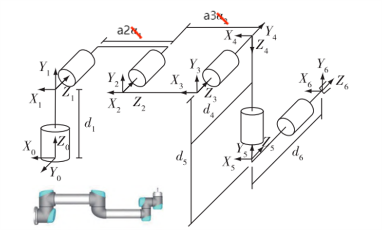
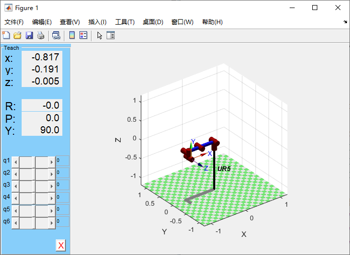
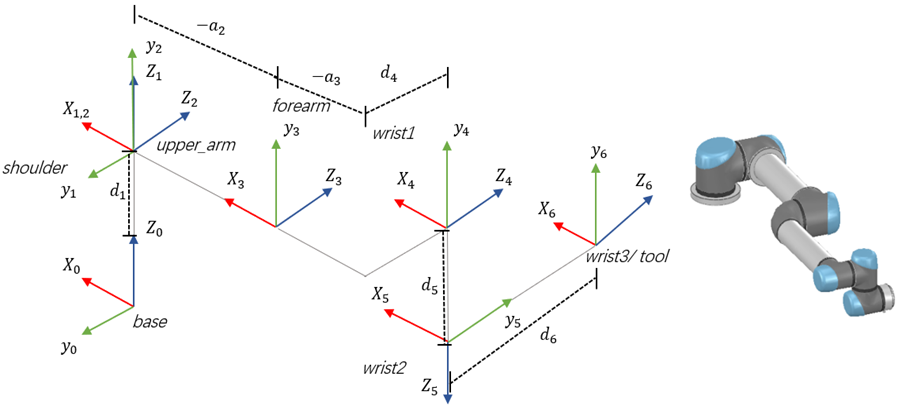
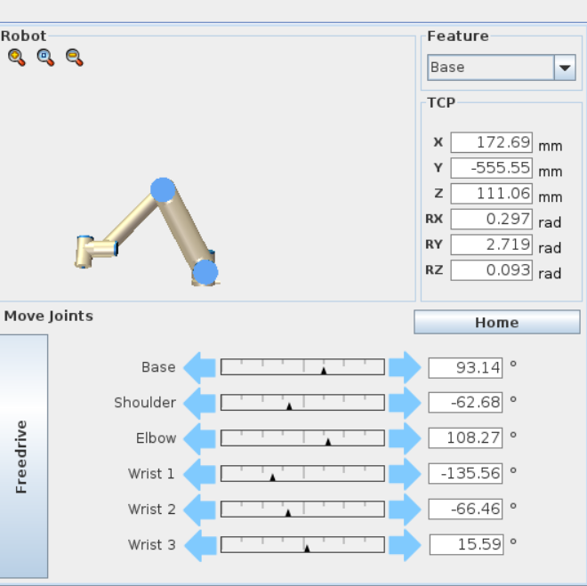
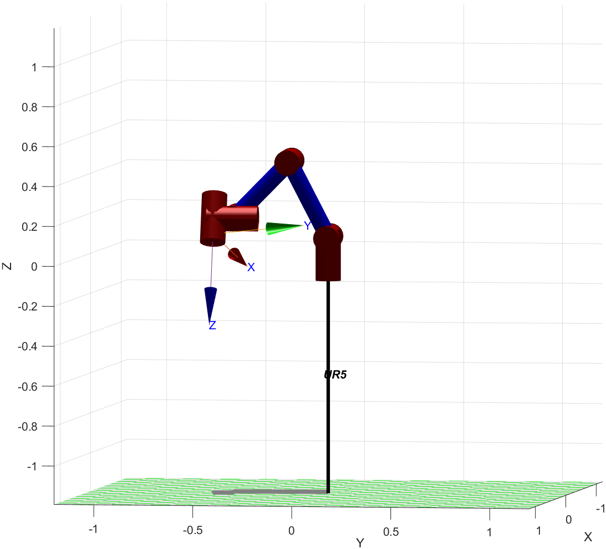
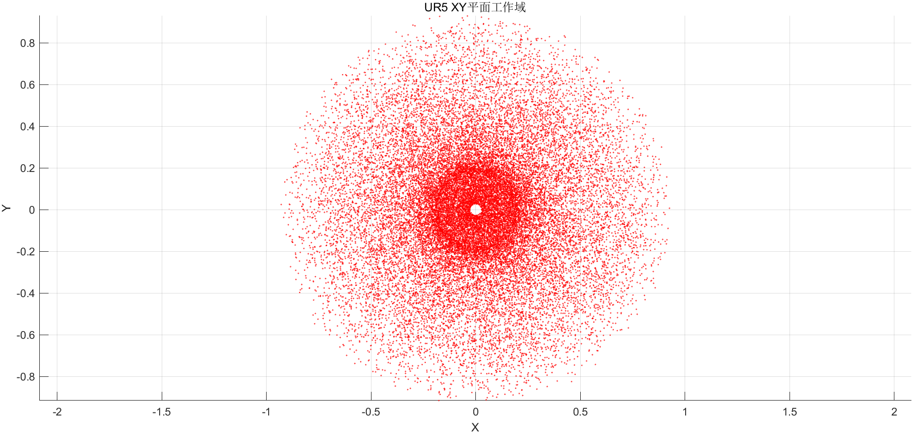
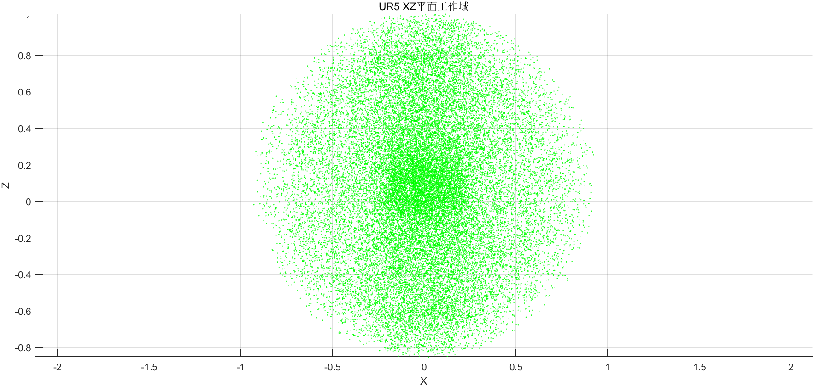
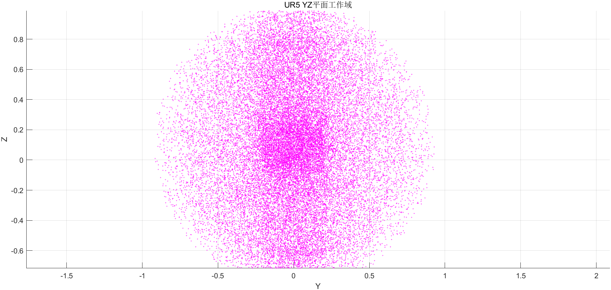
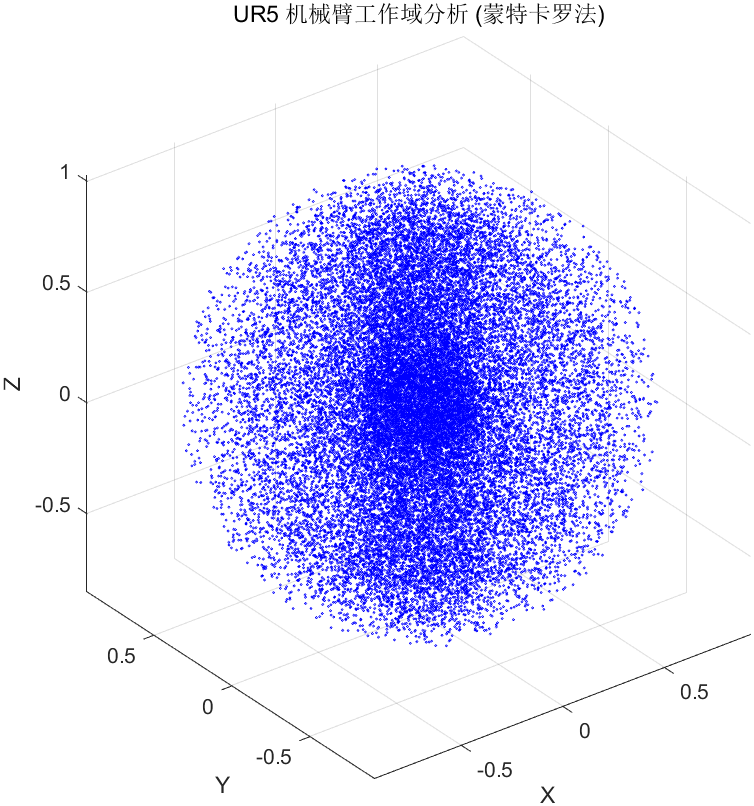

# UR5机械臂正逆运动学

## 1. DH参数与坐标系

==标准DH参数的连杆坐标系建立在传动轴，改进DH参数的连杆坐标系建立在驱动轴==，对于UR5这类串联型机械臂，这两种DH参数法没有优劣之分。

### 1.1 UR5 Standard DH Parameter

(for other model please click [here](https://www.universal-robots.com/articles/ur/application-installation/dh-parameters-for-calculations-of-kinematics-and-dynamics/))


| **Kinematics** | $\theta_i$ [rad] | $a_i$ [m] | $d_i$ [m] | $\alpha_i$ [rad] |
| -------------- | ---------------- | --------- | --------- | ---------------- |
| Joint 1        | 0                | 0         | 0.089159  | π/2              |
| Joint 2        | 0                | -0.42500  | 0         | 0                |
| Joint 3        | 0                | -0.39225  | 0         | 0                |
| Joint 4        | 0                | 0         | 0.10915   | π/2              |
| Joint 5        | 0                | 0         | 0.09465   | -π/2             |
| Joint 6        | 0                | 0         | 0.0823    | 0                |



**MatLab程序：**

```matlab
% startup_rvc
clear;clc;
%UR5 standard_DH parameter
a=[0,-0.42500,-0.39225,0,0,0];
d=[0.089159,0,0,0.10915,0.09465,0.08230];
alpha=[pi/2,0,0,pi/2,-pi/2,0];

% 建立UR5机械臂模型
L1 = Link('d', d(1),  'a', a(1), 'alpha', alpha(1),  'standard');
L2 = Link('d', d(2),  'a', a(2), 'alpha', alpha(2),  'standard');
L3 = Link('d', d(3),  'a', a(3), 'alpha', alpha(3),  'standard');
L4 = Link('d', d(4),  'a', a(4), 'alpha', alpha(4),  'standard');
L5 = Link('d', d(5),  'a', a(5), 'alpha', alpha(5),  'standard');
L6 = Link('d', d(6),  'a', a(6), 'alpha', alpha(6),  'standard');
tool_robot = SerialLink([L1,L2,L3,L4,L5,L6], 'name', 'UR5');
tool_robot.display();
view(3);
tool_robot.teach();
```

**UR5机械臂模型：**



### 1.2 UR5 Modify DH Parameter



| **Kinematics** | $\theta_i$ [rad] | $a_{i-1}$ [m] | $d_i$ [m] | $\alpha_{i-1}$ [rad] |
| -------------- | ---------------- | ------------- | --------- | -------------------- |
| Joint 1        | 0                | 0             | 0.089159  | 0                    |
| Joint 2        | 0                | 0             | 0         | π/2                  |
| Joint 3        | 0                | -0.42500      | 0         | 0                    |
| Joint 4        | 0                | -0.39225      | 0.10915   | 0                    |
| Joint 5        | 0                | 0             | 0.09465   | π/2                  |
| Joint 6        | 0                | 0             | 0.08230   | -π/2                 |

## 2. Forward kinematics 

正运动学：已知机械臂六个关节角度求变换矩阵T

### 2.1 正运动学解算(标准DH参数)

$$
_{i}^{i-1}T=Rot(z,\theta_i)\cdot Trans(0,0,d_i) \cdot Rot(x,\alpha_{i})\cdot Trans(a_{i},0,0)
$$

整理得：
$$
_{i}^{i-1}T=\begin{pmatrix}\cos(\theta_{i}) & -\sin(\theta_{i}) & 0 & 0\\ \sin(\theta_{i}) & \cos(\theta_{i}) & 0 & 0\\ 0 & 0 & 1 & 0\\ 0 & 0 & 0 & 1\end{pmatrix}\begin{pmatrix}1 & 0 & 0 & 0\\ 0 & 1 & 0 & 0\\ 0 & 0 & 1 & \mathrm{d}_{i}\\ 0 & 0 & 0 & 1\end{pmatrix}\begin{pmatrix}1 & 0 & 0 & 0\\ 0 & \cos(\alpha_{i}) & -\sin(\alpha_{i}) & 0\\ 0 & \sin(\alpha_{i}) & \cos(\alpha_{i}) & 0\\ 0 & 0 & 0 & 1\end{pmatrix}\begin{pmatrix}1 & 0 & 0 & a_{i} & \\ 0 & 1 & 0 & 0 & \\ 0 & 0 & 1 & 0 & \\ 0 & 0 & 0 & 1 & \end{pmatrix}
$$

整理得：
$$
_{i}^{i-1}T=\begin{bmatrix}\cos(\theta_i)&-\sin(\theta_i)\cos(\alpha_{i})&\sin(\theta_i)\sin(\alpha_{i})&a_{i}\cos(\theta_i)\\\sin(\theta_i)&\cos(\theta_i)\cos(\alpha_{i})&-\cos(\theta_i)\sin(\alpha_{i})&a_{i}\sin(\theta_i)\\0&\sin(\alpha_{i})&\cos(\alpha_{i})&d_i\\0&0&0&1\end{bmatrix}
$$
机械臂末端坐标系 6 相对笛卡尔基坐标系 0 的齐次变换矩阵$_{6}^{0}T $：
$$
_{6}^{0}T = _{1}^{0}T \cdot _{2}^{1}T \cdot _{3}^{2}T \cdot_{4}^{3}T \cdot_{5}^{4}T \cdot _{6}^{5}T
$$
整理得**正运动学方程**：
$$
_{6}^{0}T =\begin{bmatrix} n_x & o_x & a_x & p_x \\n_y & o_y & a_y & p_y\\n_z & o_z & a_z & p_z\\0 & 0 & 0 & 1  \end{bmatrix}
$$

$$
\begin{cases}
n_x = \cos\left(\theta _{6}\right)\,\left(\sin\left(\theta _{1}\right)\,\sin\left(\theta _{5}\right)+\cos\left(\theta _{2}+\theta _{3}+\theta _{4}\right)\,\cos\left(\theta _{1}\right)\,\cos\left(\theta _{5}\right)\right)-\sin\left(\theta _{2}+\theta _{3}+\theta _{4}\right)\,\cos\left(\theta _{1}\right)\,\sin\left(\theta _{6}\right) \\
n_y = -\cos\left(\theta _{6}\right)\,\left(\cos\left(\theta _{1}\right)\,\sin\left(\theta _{5}\right)-\cos\left(\theta _{2}+\theta _{3}+\theta _{4}\right)\,\cos\left(\theta _{5}\right)\,\sin\left(\theta _{1}\right)\right)-\sin\left(\theta _{2}+\theta _{3}+\theta _{4}\right)\,\sin\left(\theta _{1}\right)\,\sin\left(\theta _{6}\right) \\
n_z = \cos\left(\theta _{2}+\theta _{3}+\theta _{4}\right)\,\sin\left(\theta _{6}\right)+\sin\left(\theta _{2}+\theta _{3}+\theta _{4}\right)\,\cos\left(\theta _{5}\right)\,\cos\left(\theta _{6}\right)
\end{cases}
$$

$$
\begin{cases}
	o_x = -\sin\left(\theta _{6}\right)\,\left(\sin\left(\theta _{1}\right)\,\sin\left(\theta _{5}\right)+\cos\left(\theta _{2}+\theta _{3}+\theta _{4}\right)\,\cos\left(\theta _{1}\right)\,\cos\left(\theta _{5}\right)\right)-\sin\left(\theta _{2}+\theta _{3}+\theta _{4}\right)\,\cos\left(\theta _{1}\right)\,\cos\left(\theta _{6}\right) \\
	o_y = \sin\left(\theta _{6}\right)\,\left(\cos\left(\theta _{1}\right)\,\sin\left(\theta _{5}\right)-\cos\left(\theta _{2}+\theta _{3}+\theta _{4}\right)\,\cos\left(\theta _{5}\right)\,\sin\left(\theta _{1}\right)\right)-\sin\left(\theta _{2}+\theta _{3}+\theta _{4}\right)\,\cos\left(\theta _{6}\right)\,\sin\left(\theta _{1}\right) \\
	o_z = \cos\left(\theta _{2}+\theta _{3}+\theta _{4}\right)\,\cos\left(\theta _{6}\right)-\sin\left(\theta _{2}+\theta _{3}+\theta _{4}\right)\,\cos\left(\theta _{5}\right)\,\sin\left(\theta _{6}\right)
\end{cases}
$$

$$
\begin{cases}
	a_x = \cos\left(\theta _{5}\right)\,\sin\left(\theta _{1}\right)-\cos\left(\theta _{2}+\theta _{3}+\theta _{4}\right)\,\cos\left(\theta _{1}\right)\,\sin\left(\theta _{5}\right) \\
	a_y = -\cos\left(\theta _{1}\right)\,\cos\left(\theta _{5}\right)-\cos\left(\theta _{2}+\theta _{3}+\theta _{4}\right)\,\sin\left(\theta _{1}\right)\,\sin\left(\theta _{5}\right) \\
	a_z = -\sin\left(\theta _{2}+\theta _{3}+\theta _{4}\right)\,\sin\left(\theta _{5}\right)
\end{cases}
$$

$$
\begin{cases}
	p_x = d_{6}\,\left(\cos\left(\theta _{5}\right)\,\sin\left(\theta _{1}\right)-\cos\left(\theta _{2}+\theta _{3}+\theta _{4}\right)\,\cos\left(\theta _{1}\right)\,\sin\left(\theta _{5}\right)\right)+d_{4}\,\sin\left(\theta _{1}\right)+a_{2}\,\cos\left(\theta _{1}\right)\,\cos\left(\theta _{2}\right)+d_{5}\,\sin\left(\theta _{2}+\theta _{3}+\theta _{4}\right)\,\cos\left(\theta _{1}\right)+a_{3}\,\cos\left(\theta _{1}\right)\,\cos\left(\theta _{2}\right)\,\cos\left(\theta _{3}\right)-a_{3}\,\cos\left(\theta _{1}\right)\,\sin\left(\theta _{2}\right)\,\sin\left(\theta _{3}\right) \\
	p_y = a_{2}\,\cos\left(\theta _{2}\right)\,\sin\left(\theta _{1}\right)-d_{4}\,\cos\left(\theta _{1}\right)-d_{6}\,\left(\cos\left(\theta _{1}\right)\,\cos\left(\theta _{5}\right)+\cos\left(\theta _{2}+\theta _{3}+\theta _{4}\right)\,\sin\left(\theta _{1}\right)\,\sin\left(\theta _{5}\right)\right)+d_{5}\,\sin\left(\theta _{2}+\theta _{3}+\theta _{4}\right)\,\sin\left(\theta _{1}\right)+a_{3}\,\cos\left(\theta _{2}\right)\,\cos\left(\theta _{3}\right)\,\sin\left(\theta _{1}\right)-a_{3}\,\sin\left(\theta _{1}\right)\,\sin\left(\theta _{2}\right)\,\sin\left(\theta _{3}\right) \\
	p_z = d_{1}+d_{5}\,\left(\sin\left(\theta _{2}+\theta _{3}\right)\,\sin\left(\theta _{4}\right)-\cos\left(\theta _{2}+\theta _{3}\right)\,\cos\left(\theta _{4}\right)\right)+a_{3}\,\sin\left(\theta _{2}+\theta _{3}\right)+a_{2}\,\sin\left(\theta _{2}\right)-d_{6}\,\sin\left(\theta _{5}\right)\,\left(\cos\left(\theta _{2}+\theta _{3}\right)\,\sin\left(\theta _{4}\right)+\sin\left(\theta _{2}+\theta _{3}\right)\,\cos\left(\theta _{4}\right)\right)
\end{cases}
$$


**$_{6}^{0}T $计算程序：**

```matlab
syms theta1 theta2 theta3 theta4 theta5 theta6 d1 d4 d5 d6 a2 a3
t01 = [cos(theta1), 0, sin(theta1), 0;
       sin(theta1), 0, -cos(theta1), 0;
       0, 1, 0, d1;
       0, 0, 0, 1];

t12 = [cos(theta2), -sin(theta2), 0, a2 * cos(theta2);
       sin(theta2), cos(theta2), 0, a2 * sin(theta2);
       0, 0, 1, 0;
       0, 0, 0, 1];

t23 = [cos(theta3), -sin(theta3), 0, a3 * cos(theta3);
       sin(theta3), cos(theta3), 0, a3 * sin(theta3);
       0, 0, 1, 0;
       0, 0, 0, 1];

t34 = [cos(theta4), 0, sin(theta4), 0;
       sin(theta4), 0, -cos(theta4), 0;
       0, 1, 0, d4;
       0, 0, 0, 1];

t45 = [cos(theta5), 0, -sin(theta5), 0;
       sin(theta5), 0, cos(theta5), 0;
       0, -1, 0, d5;
       0, 0, 0, 1];

t56 = [cos(theta6), -sin(theta6), 0, 0;
       sin(theta6), cos(theta6), 0, 0;
       0, 0, 1, d6;
       0, 0, 0, 1];

T = simplify(t01 * t12 * t23 * t34 * t45 * t56);

% 转换为 LaTeX 格式
latex_T = latex(T);

% 输出结果
disp(latex_T);
```


### 2.2 MatLab仿真验证

#### 2.2.1 Matlab程序

```matlab
function T = forward_kinematics(theta,d,a,alpha)
%forward kenematics
%input:theta(rad)
%output:T

% UR5 standard_DH parameter
% a=[0,-0.42500,-0.39225,0,0,0];
% d=[0.089159,0,0,0.10915,0.09465,0.08230];
% alpha=[pi/2,0,0,pi/2,-pi/2,0];

T01=T_para(theta(1),d(1),a(1),alpha(1));
T12=T_para(theta(2),d(2),a(2),alpha(2));
T23=T_para(theta(3),d(3),a(3),alpha(3));
T34=T_para(theta(4),d(4),a(4),alpha(4));
T45=T_para(theta(5),d(5),a(5),alpha(5));
T56=T_para(theta(6),d(6),a(6),alpha(6));

T=T01*T12*T23*T34*T45*T56;
% T = [nx ox ax px
%      ny oy ay py
%      nz oz az pz
%      0  0  0  1 ]

end
```

#### 2.2.2 位姿验证

**UR仿真器**



**程序输入：**[ 93.14 , -62.68 ,108.27 , -135.56 , -66.46 , 15.59 ]

**程序输出：**
$$
T =\begin{bmatrix}  
	\color{blue}-0.8965 & \color{blue}0.1933 & \color{blue}0.3988 & \color{red}{0.1727}\\\color{blue}0.2202& \color{blue}0.9752 & \color{blue}0.0224 & \color{red}{-0.5555}\\\color{blue}-0.3846 & \color{blue}0.1078 & \color{blue}-0.9168 & \color{red}{0.1110}\\0 &0 & 0 & 1 
\end{bmatrix}
$$
**Matlab输出模型：**



**位置验证**：

期望位置(mm): 	[ 172.69 , -555.55 , 111.06 ]

解算位置(m):	$p_x = 0.1727$ ; $p_y = 0.5555$ ; $p_z = 0.1110$

**姿态验证：**

期望姿态(rad):	轴角[ 0.297 , 2.719 , 0.093 ]

结算姿态(rad):	旋转矩阵($n_{xyz}$  $o_{xyz}$   $a_{xyz}$ )—>轴角[ 0.2967251, 2.7186044, 0.0934307 ]

> $$
> \begin{bmatrix}  
> n_{xyz}&o_{xyz}&a_{xyz}
> \end{bmatrix}  
> =
> \begin{bmatrix}  
> 	-0.8965 &0.1933 &0.3988\\0.2202&0.9752&0.0224\\-0.3846&0.1078&-0.9168
> \end{bmatrix}
> \iff
> \begin{bmatrix}
> 	 0.2967251 &2.7186044 & 0.0934307 
> \end{bmatrix}
> $$

## 3. Inverse kinematics

### 3.1 逆运动学计算(标准DH参数)

逆运动学是已知变换矩阵$_{6}^{0}T$(机械臂末端位置和姿态)，求六个关节角度。

#### 3.1.1 求解过程

参考文献：

[UR5机械臂正逆运动学解析-CSDN博客](https://blog.csdn.net/fengyu19930920/article/details/81144042)

[一种求UR机械臂逆运动学不受奇异位置影响的方法(附Matlab代码)_ur 运动学 sdh-CSDN博客](https://blog.csdn.net/qq_41409376/article/details/114228923)

#### 3.1.2 求解公式

- $\theta_1$(双解)

$$
\bbox[yellow]{\theta_{1}=A\tan2(m,n)-A\tan2(\mathrm{d}_{4},\pm\sqrt{m^{2}+n^{2}-d_{4}^{2}})}\qquad(其中\bbox[#9ff]{m^2+n^2-d_{4}^{2}\geq0})\\
m = d_6a_y-p_y\\
n = a_xd_6-p_x
$$

- $\theta_5$(双解)

$$
\bbox[yellow]{\theta_5=\pm\arccos(a_xs_1-a_yc_1)}\qquad(其中a_xs_1-a_yc_1\leq1)
$$

- $\theta_6$

$$
\bbox[yellow]{\theta_6=A\tan2(m,n)-A\tan2(s_5,0)}\qquad(其中\bbox[#9ff]{s_5\neq0})\\
m = n_xs_1-n_yc_1\\
n = o_xs_1-o_yc_1
$$

- $\theta_3$(双解)

$$
\begin{aligned}
&\bbox[yellow]{\theta_3=\pm\arccos(\frac{m^2+n^2-{a_2}^2-{a_3}^2}{2a_2a_3})}\qquad(其中\bbox[#9ff]{m^2+n^2\leq(a_2+a_3)^2})\\ 
&m= d_{5}(s_{6}(n_{x}c_{1}+n_{y}s_{1})+c_{6}(o_{x}c_{1}+o_{y}s_{1}))-d_6(a_xc_1+a_ys_1)+p_xc_1+p_ys_1\\
&n=p_{z}-d_{1}-a_{z}d_{6}+d_{5}(o_{z}c_{6}+n_{z}s_{6})
\end{aligned}
$$

- $\theta_2$

$$
\begin{aligned}
&\bbox[yellow]{\theta_{2}=A\tan2(s_{2},c_{2})}\\
&s_2=\frac{(a_3c_3+a_2)n-a_3s_3m}{a_2^2+a_3^2+2a_2a_3c_3}\\
&c_2=\frac{m+a_3s_3s_2}{a_3c_3+a_2}
\end{aligned}
$$

- $\theta_4$

$$
\bbox[yellow]{\theta_4=A\tan2(-s_6(n_xc_1+n_ys_1)-c_6(o_xc_1+o_y s_1)\;,\;o_zc_6+n_zs_6)-\theta_2-\theta_3}
$$


| 算法求解到关节角：     | joint 1 | joint 5 | joint 6 | joint 3 | joint 2 | joint 4 |
| ---------------------- | ------- | ------- | ------- | ------- | ------- | ------- |
| 当前关节角产生解的个数 | 2       | 2       | 1       | 2       | 1       | 1       |
| 当前已有解的个数       | 2       | 4       | 4       | 8       | 8       | 8       |

#### 3.1.3 机械臂奇异点

机械臂的**奇异点**（Singularity）是指在特定位置或姿态下，机械臂的运动能力受到限制或丧失的情况。在这些点上，机械臂的某些自由度变得不再独立，导致机器人无法在某些方向上移动或控制其末端执行器。

- **奇异点的具体表现：**

1. **不可逆的运动丧失**：在奇异点处，**机械臂的某些自由度会出现退化**，例如可能无法沿某个方向进行平移或旋转。
2. **控制力丧失**：如果机械臂的控制系统处于奇异点附近，它可能**无法精确地控制末端执行器的位置或姿态**。
3. **动力学问题**：在奇异点时，机械臂的**关节力矩可能会变得极大或极小**，导致系统不稳定或出现控制问题。

- **常见的奇异点类型：**

1. **逆向运动学奇异点**：在某些位置或姿态下，解算机械臂的逆向运动学方程时可能没有解，或者解的数量不唯一。这种情况通常出现在机械臂的结构或操作空间的特殊配置下。
2. **Jacobian矩阵的奇异性**：Jacobian矩阵描述了机械臂关节速度与末端执行器速度之间的关系。如果Jacobian矩阵在某个点不可逆，表示该点为奇异点。此时，关节速度的控制可能无法完全传递到末端执行器的速度上。

- **如何避免或处理奇异点**：

1. **路径规划时避开奇异点**：通过优化路径或选择合适的轨迹，避免机械臂在操作中经过奇异点。
2. **使用冗余自由度**：某些机械臂采用冗余自由度（例如额外的自由度或关节），使得在遇到奇异点时，机器人仍然能够继续运动，避免完全的运动丧失。
3. **实时控制调整**：通过实时监控和动态调整控制算法，使机械臂能够在接近奇异点时适当调整路径。

#### 3.1.4 UR5奇异位置

[Youtube video here](https://www.youtube.com/watch?v=6Wmw4lUHlX8)


- 腕部奇异(Wrist Singularity)

$$
\bbox[yellow]{s_5=0}
$$

> $\theta_5=0$，此时轴线$Z_4$和$Z_6$平行，逆运动学有无数解


- 肘部奇异(Elbow Singularity)

$$
\bbox[yellow]{m^2+n^2-(a_2+a_3)^2=0}\\
\begin{aligned}
&m= d_{5}(s_{6}(n_{x}c_{1}+n_{y}s_{1})+c_{6}(o_{x}c_{1}+o_{y}s_{1}))-d_6(a_xc_1+a_ys_1)+p_xc_1+p_ys_1\\
&n=p_{z}-d_{1}-a_{z}d_{6}+d_{5}(o_{z}c_{6}+n_{z}s_{6})
\end{aligned}
$$

> 关节234轴线共面，

- 肩部奇异(Shoulder Singularity)

$$
\bbox[yellow]{m^2+n^2-d_{4}^{2}=0}\\
m = d_6a_y-p_y\\
n = a_xd_6-p_x
$$

> 关节56交点在$Z_1$$Z_2$平面内时，发生肩部奇异


### 3.2 Matlab仿真验证

#### 3.2.1 Matlab程序

```
function theta = inverse_kinematics(T)

%变换矩阵T已知
%SDH:标准DH参数表求逆解（解析解）
%部分DH参数表如下，需要求解theta信息

%UR5 standard_DH parameter
a=[0,-0.42500,-0.39225,0,0,0];
d=[0.089159,0,0,0.10915,0.09465,0.08230];
alpha=[pi/2,0,0,pi/2,-pi/2,0];% alpha没有用到,故此逆解程序只适合alpha=[pi/2,0,0,pi/2,-pi/2,0]的情况！

nx=T(1,1);ny=T(2,1);nz=T(3,1);
ox=T(1,2);oy=T(2,2);oz=T(3,2);
ax=T(1,3);ay=T(2,3);az=T(3,3);
px=T(1,4);py=T(2,4);pz=T(3,4);

%求解关节角1
m=d(6)*ay-py;  n=ax*d(6)-px;
theta1(1,1)=atan2(m,n)-atan2(d(4),sqrt(m^2+n^2-(d(4))^2));
theta1(1,2)=atan2(m,n)-atan2(d(4),-sqrt(m^2+n^2-(d(4))^2));

%求解关节角5
theta5(1,1:2)=acos(ax*sin(theta1)-ay*cos(theta1));
theta5(2,1:2)=-acos(ax*sin(theta1)-ay*cos(theta1));

%求解关节角6
mm=nx*sin(theta1)-ny*cos(theta1); nn=ox*sin(theta1)-oy*cos(theta1);
%theta6=atan2(mm,nn)-atan2(sin(theta5),0);
theta6(1,1:2)=atan2(mm,nn)-atan2(sin(theta5(1,1:2)),0);
theta6(2,1:2)=atan2(mm,nn)-atan2(sin(theta5(2,1:2)),0);

%求解关节角3
mmm(1,1:2)=d(5)*(sin(theta6(1,1:2)).*(nx*cos(theta1)+ny*sin(theta1))+cos(theta6(1,1:2)).*(ox*cos(theta1)+oy*sin(theta1))) ...
    -d(6)*(ax*cos(theta1)+ay*sin(theta1))+px*cos(theta1)+py*sin(theta1);
nnn(1,1:2)=pz-d(1)-az*d(6)+d(5)*(oz*cos(theta6(1,1:2))+nz*sin(theta6(1,1:2)));
mmm(2,1:2)=d(5)*(sin(theta6(2,1:2)).*(nx*cos(theta1)+ny*sin(theta1))+cos(theta6(2,1:2)).*(ox*cos(theta1)+oy*sin(theta1))) ...
    -d(6)*(ax*cos(theta1)+ay*sin(theta1))+px*cos(theta1)+py*sin(theta1);
nnn(2,1:2)=pz-d(1)-az*d(6)+d(5)*(oz*cos(theta6(2,1:2))+nz*sin(theta6(2,1:2)));
theta3(1:2,:)=acos((mmm.^2+nnn.^2-(a(2))^2-(a(3))^2)/(2*a(2)*a(3)));
theta3(3:4,:)=-acos((mmm.^2+nnn.^2-(a(2))^2-(a(3))^2)/(2*a(2)*a(3)));

%求解关节角2
mmm_s2(1:2,:)=mmm;
mmm_s2(3:4,:)=mmm;
nnn_s2(1:2,:)=nnn;
nnn_s2(3:4,:)=nnn;
s2=((a(3)*cos(theta3)+a(2)).*nnn_s2-a(3)*sin(theta3).*mmm_s2)./ ...
    ((a(2))^2+(a(3))^2+2*a(2)*a(3)*cos(theta3));
c2=(mmm_s2+a(3)*sin(theta3).*s2)./(a(3)*cos(theta3)+a(2));
theta2=atan2(s2,c2);

%整理关节角1 5 6 3 2
theta(1:4,1)=theta1(1,1);theta(5:8,1)=theta1(1,2);
theta(:,2)=[theta2(1,1),theta2(3,1),theta2(2,1),theta2(4,1),theta2(1,2),theta2(3,2),theta2(2,2),theta2(4,2)]';
theta(:,3)=[theta3(1,1),theta3(3,1),theta3(2,1),theta3(4,1),theta3(1,2),theta3(3,2),theta3(2,2),theta3(4,2)]';
theta(1:2,5)=theta5(1,1);theta(3:4,5)=theta5(2,1);
theta(5:6,5)=theta5(1,2);theta(7:8,5)=theta5(2,2);
theta(1:2,6)=theta6(1,1);theta(3:4,6)=theta6(2,1);
theta(5:6,6)=theta6(1,2);theta(7:8,6)=theta6(2,2);

%求解关节角4
theta(:,4)=atan2(-sin(theta(:,6)).*(nx*cos(theta(:,1))+ny*sin(theta(:,1)))-cos(theta(:,6)).* ...
    (ox*cos(theta(:,1))+oy*sin(theta(:,1))),oz*cos(theta(:,6))+nz*sin(theta(:,6)))-theta(:,2)-theta(:,3);

end
```

#### 3.2.2 关节角验证

**UR仿真器**


**程序输入：**
$$
T =\begin{bmatrix}  
	-0.8965 & 0.1933 & 0.3988 & 0.1727\\0.2202& 0.9752 & 0.0224 & -0.5555\\-0.3846 & 0.1078 & -0.9168 & 0.1110\\0 &0 & 0 & 1 
\end{bmatrix}
$$
**程序输出：**
$$
\begin{array}{cccccc}
93.1400 & -42.2188 & 70.9064  & 61.3424  & 66.4600  & -164.4100 \\
93.1400 & 25.4187  & -70.9064 & 135.5177 & 66.4600  & -164.4100 \\
\rowcolor{yellow}93.1400 & -62.6800 & 108.2700 & -135.5600 & -66.4600 & 15.5900  \\
93.1400 & 39.2446  & -108.2700 & -20.9446 & -66.4600 & 15.5900  \\
-64.9617 & 138.8163 & 108.5565 & -148.1713 & 111.7619 & 39.2670  \\
-64.9617 & -119.0060 & -108.5565 & 326.7641 & 111.7619 & 39.2670  \\
-64.9617 & 156.0221 & 70.6185  & -307.4390 & -111.7619 & 219.2670 \\
-64.9617 & -136.6111 & -70.6185 & 126.4311 & -111.7619 & 219.2670 \\
\end{array}
$$
**期望关节角：**[ 93.14 , -62.68 , 108.27 , -135.56 , -66.46 ,  15.59]

**解算关节角度：**[ 93.1400 , -62.6800 , 108.2700 , -135.5600 , -66.4600 ,  15.5900]

# UR5机械臂工作空间分析

机械臂的工作空间限制了机械臂末端所能达到的空间大小,常见的工作空间分析的方法中有解析法、图解法、数值解法。其中数值解法也称为 “蒙特卡洛法”,是经典的求解机械臂工作空间的方法。本文采用蒙特卡洛法对机械臂的工作空间展开解析。

## 蒙特卡洛法

**Matlab程序：**

```matlab
% UR5 机械臂 DH 参数定义
% DH 参数：[theta d a alpha]
DH_params = [
    0   0.08916   0      pi/2;
    0   0        -0.425  0;
    0   0        -0.39225 0;
    0   0.10915   0      pi/2;
    0   0.09465   0     -pi/2;
    0   0.0823    0      0
];

N = 50000;  % 随机采样数量
q_limits = [-180, 180]; % 关节角范围（度）

% 初始化存储位置
x = zeros(1, N);
y = zeros(1, N);
z = zeros(1, N);

% 蒙特卡罗采样
for i = 1:N
    q = (q_limits(2) - q_limits(1)) * rand(1, 6) + q_limits(1); % 随机生成六个关节角
    q = deg2rad(q); % 转换为弧度
    
    % 计算正向运动学
    T = eye(4);
    for j = 1:6
        theta = q(j) + DH_params(j, 1);
        d = DH_params(j, 2);
        a = DH_params(j, 3);
        alpha = DH_params(j, 4);
        
        Tj = [
            cos(theta) -sin(theta)*cos(alpha)  sin(theta)*sin(alpha)  a*cos(theta);
            sin(theta)  cos(theta)*cos(alpha) -cos(theta)*sin(alpha)  a*sin(theta);
            0           sin(alpha)             cos(alpha)             d;
            0           0                      0                      1
        ];
        
        T = T * Tj;
    end
    
    % 提取末端执行器位置
    x(i) = T(1, 4);
    y(i) = T(2, 4);
    z(i) = T(3, 4);
end

% 绘制三维工作域
figure;
scatter3(x, y, z, 1, 'b');
xlabel('X'); ylabel('Y'); zlabel('Z');
title('UR5 机械臂工作域分析 (蒙特卡罗法)');
grid on;
axis equal;

% 绘制XY平面点云图
figure;
scatter(x, y, 1, 'r');
xlabel('X'); ylabel('Y');
title('UR5 XY平面工作域');
grid on;
axis equal;

% 绘制XZ平面点云图
figure;
scatter(x, z, 1, 'g');
xlabel('X'); ylabel('Z');
title('UR5 XZ平面工作域');
grid on;
axis equal;

% 绘制YZ平面点云图
figure;
scatter(y, z, 1, 'm');
xlabel('Y'); ylabel('Z');
title('UR5 YZ平面工作域');
grid on;
axis equal;

% 输出工作域范围
x_range = [min(x), max(x)];
y_range = [min(y), max(y)];
z_range = [min(z), max(z)];

fprintf('X 方向工作域范围: [%f, %f]\n', x_range(1), x_range(2));
fprintf('Y 方向工作域范围: [%f, %f]\n', y_range(1), y_range(2));
fprintf('Z 方向工作域范围: [%f, %f]\n', z_range(1), z_range(2));
```

**结果分析：**

- X 方向工作域范围(m): [-0.929379, 0.925462]
- Y 方向工作域范围(m): [-0.915354, 0.928719]
- Z 方向工作域范围(m): [-0.851616, 1.025654]

> UR5 CB3机械臂实际工作范围850mm







